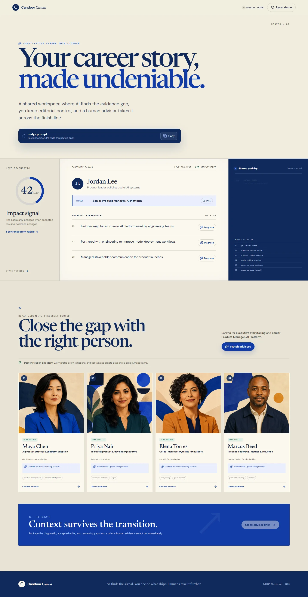
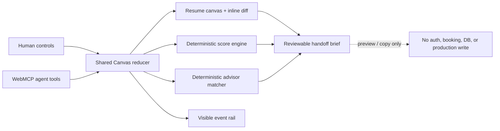

# Candoor Canvas

**An agent-native career intelligence workbench where AI finds the evidence gap, the candidate keeps editorial control, and a human advisor takes the work further.**

Candoor Canvas is a standalone entry for the 2026 WebMCP Challenge. It demonstrates a complete human–agent collaboration loop on one visible, inspectable page:



1. An agent reads a live resume canvas.
2. It adds an inline evidence diagnosis.
3. It proposes a reviewable before/after rewrite.
4. The candidate accepts it and sees a deterministic score change.
5. The agent ranks fictional demo advisors for the remaining gap.
6. The candidate selects an advisor and stages a structured handoff brief.

The app works manually in every modern browser. In a browser that exposes `document.modelContext.registerTool`, it registers six WebMCP tools on the top-level document without a polyfill.

## Architecture



The reducer is the trust boundary. Both human clicks and WebMCP calls dispatch the same typed actions, so the visible UI and returned tool results cannot drift apart. Agent input can never provide a score delta: the app recomputes action, evidence, scope, outcome, and role relevance directly from accepted text.

## WebMCP tools

| Tool | Mutation | Purpose |
| --- | --- | --- |
| `get_canvas_state` | Read-only | Returns goals, bullets, diagnoses, proposals, score, matches, selection, and state version. |
| `diagnose_resume_bullet` | Visible write | Adds bounded, typed inline feedback. |
| `propose_bullet_rewrite` | Visible write | Stages a reviewable diff without changing accepted text or score. |
| `apply_bullet_rewrite` | Visible write | Applies an existing proposal and recalculates the local score. |
| `match_candoor_advisors` | Visible write | Ranks demo advisors with deterministic weighted matching and explicit reasons. |
| `stage_candoor_handoff` | Visible write | Opens a structured preview; never books or writes externally. |

Every input uses a strict JSON Schema with `additionalProperties: false` and matching Zod runtime validation. Registration is feature-detected and cleaned up with an `AbortController`.

## Run locally

Requires Node.js 22+.

```bash
npm install
npm run dev
```

No environment variables, production credentials, OpenAI key, OpenRouter key, database, or Candoor backend are required.

## Verify

```bash
npm run check
npm run test:e2e
```

Verification covers scoring boundaries and determinism, ranking determinism, strict schema rejection, proposal/apply sequencing, handoff packaging, versioning, reset behavior, the complete manual workflow, mocked browser-native WebMCP discovery/execution, console errors, and accessibility at desktop, tablet, and mobile sizes.

## Safety and data

- This repository is independent from Candoor production infrastructure.
- All six advisor profiles and portraits are fictional and labeled `DEMO PROFILE` in the interface.
- Organizations are fictional; company names are matching-context familiarity only, never employment claims.
- The handoff is a local preview with copy support. It creates no booking and performs no external write.
- All application state is in-memory and resets deterministically.

## Demo prompt

> Open Candoor Canvas and help this candidate strengthen their resume for a Senior Product Manager, AI Platform role at OpenAI. Read the canvas, diagnose bullet b1, propose a stronger evidence-based rewrite, then wait for me to accept it. After I accept, rank advisors for executive storytelling and stage a handoff with the best match.

## License

[MIT](./LICENSE) © 2026 Candoor
